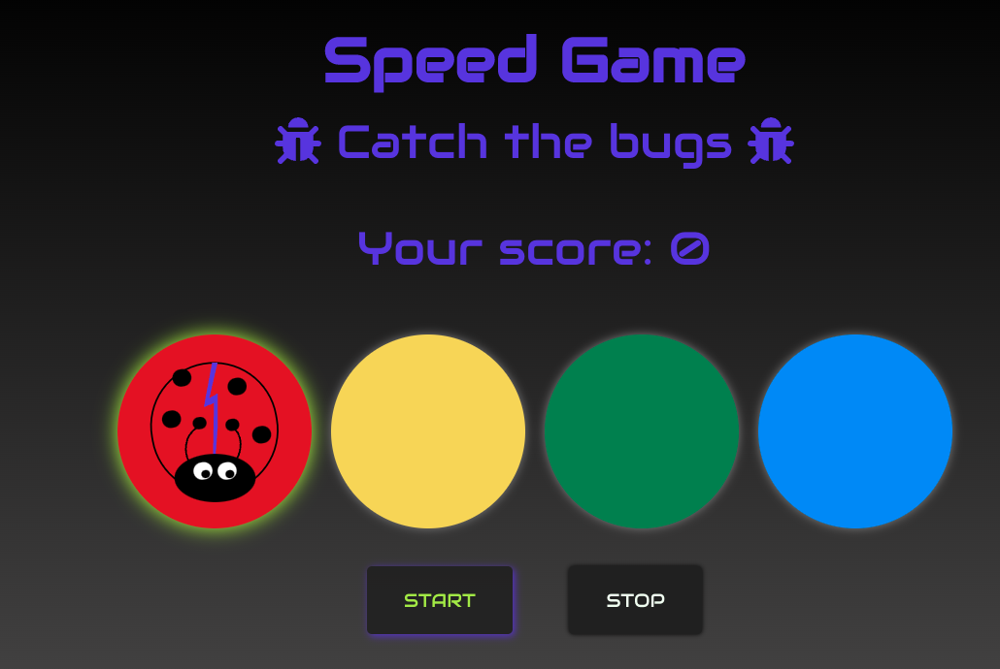
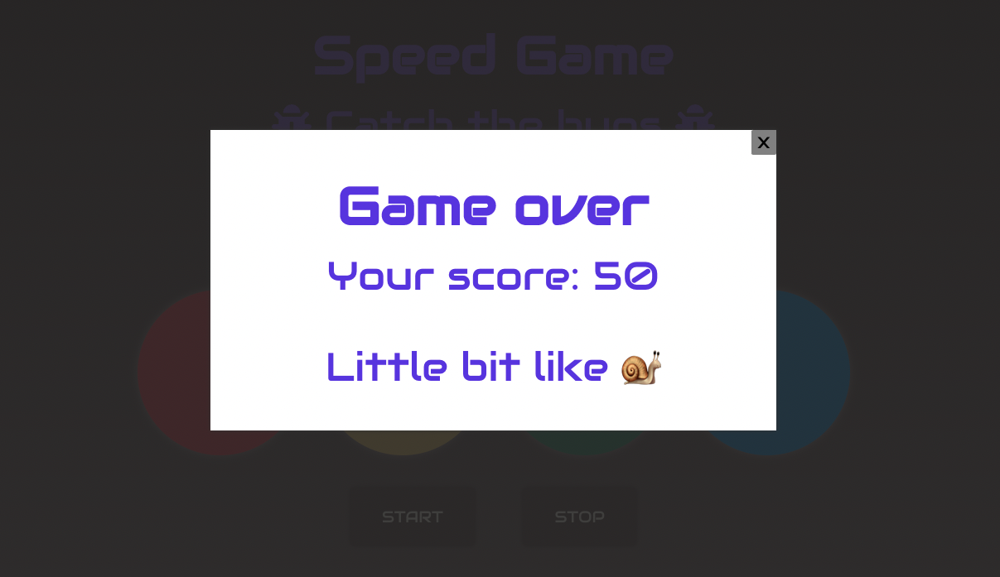

# Speed Game

School project with REACT: started with 4 weeks studies of REACT, coding with teacher.

## Introduction

Game was coded to learn usage of REACT.
How to add sound and pictures.

## Technologies used

- REACT
- JavaScript (JSX)
- HTML
- CSS

## Visuals

Screenshots & video clip of game

https://user-images.githubusercontent.com/88388526/142942005-7b74cf2a-5e84-464e-96ff-65cfc88fddb6.mov

## Usage

run `npm install`

Enjoy playing:

- press start to start the game
- try to catch next button to be pressed before next is activated
- if you fail or there will be 5 unpressed "buttons" the game will end
- and if you really want, you can always stop the gane from stop button

### Further development

- Mute button
- Remembering the sequens

## Credits for sound effects

Sounds from opengameart.org
["Happy Adveture (Loop)" by TinyWorlds licensed CC0](https://opengameart.org/content/happy-adventure-loop)

["Cute Mission Complete: complete.wav" by Fupi licenced CC0](https://opengameart.org/content/cute-mission-complete)

["ping_pong_8bit_plop.ogg" from sounds_ping_pong_8bit collection by captaincrunch80](https://opengameart.org/content/3-ping-pong-sounds-8-bit-style)

## Authors

Made by me: Saara
Basicly copied from my teacher @margittennosaar

## Some stuff to remember

> `npm i --save @fortawesome/fontawesome-svg-core`
>
> `npm install --save @fortawesome/free-solid-svg-icons`
>
> `npm install --save @fortawesome/react-fontawesome`

> `import ReactDOM from 'react-dom'` > `import { FontAwesomeIcon } from '@fortawesome/react-fontawesome'` > `import { faCoffee } from '@fortawesome/free-solid-svg-icons'`

> `const element = <FontAwesomeIcon icon={faCoffee} />`

### fixing problems before re-install

To fix the dependency tree, try following the steps below in the exact order: 1. Delete package-lock.json (not package.json!) and/or yarn.lock in your project folder. 2. Delete node_modules in your project folder. 3. Remove "webpack" from dependencies and/or devDependencies in the package.json file in your project folder. 4. Run npm install or yarn, depending on the package manager you use.
_instructions from netlify_
